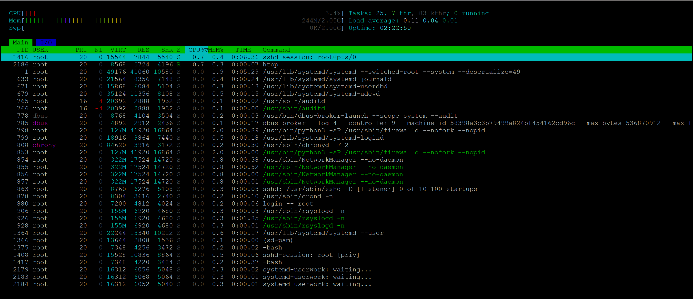

# Assignment 1: DevOps System Monitoring Setup

## Problem Description

TechCorp is onboarding two developers, **Sarah** and **Mike**. Their development environments must meet the following criteria:

- **Secure and monitored**
- **Capable of logging and troubleshooting**
- **Equipped with automated backups**

## Your Role

You are assisting **Rahul**, the Senior DevOps Engineer, with configuring system monitoring solutions that achieve these goals.

---

## Monitoring Requirements

To ensure a reliable environment, your monitoring setup should:

- Diagnose intermittent performance issues
- Provide visibility into:
  - **CPU usage**
  - **Memory usage**
  - **Disk usage**
- Track system metrics for capacity planning

---

## Tasks

1. Identify monitoring tools suitable for Linux environments (e.g., `top`, `htop`, `glances`, `vmstat`, `iotop`, `Nagios`, `Prometheus`, etc.)
2. Configure logging solutions to capture and troubleshoot incidents.
3. Set up automated backup procedures.
4. Document your configuration steps and reasoning.

---

## Deliverables

- Configuration files/scripts for system monitoring and logging.
- Documentation summarizing your setup and the tools used.
- Recommendations for ongoing capacity planning and troubleshooting.

---

> **Tip:** Use code blocks, structured documentation, and helpful comments in your scripts/config files to make your work easy to understand and maintain.

##  Plan to Solve
🔧 Install Monitoring Tools
- Use yum to install htop or nmon for real-time monitoring
- Use built-in df and du for disk usage tracking

📊 Monitor System Resources
- Use htop/nmon to observe CPU, memory, and process usage
- Use ps to identify resource-intensive processes
-
💽 Track Disk Usage
- Use df -h to check mounted disk usage
- Use du -sh /path to analyze directory sizes

🧾 Enable Logging
- Use journalctl for system logs
- Optionally install sysstat for historical metrics (sar)

📝 Create a Basic Report
- Save command outputs to log files
- Document findings and include screenshots

## Solution

### 🔧 A. Installed Monitoring Tools
- `sudo yum install epel-release -y`
- `sudo yum install htop -y`
- `sudo yum install nmon -y`
- `sudo yum install sysstat -y`


📸 htop or nmon running in terminal



---

### 📊 B. Monitored CPU, Memory, and Processes
- `htop` 
- `ps aux --sort=-%mem | head` 
- `ps aux --sort=-%cpu | head` 


📸 Screenshot Placeholder:
Top resource-consuming processes

### 💽 C. Tracked Disk Usage
- `df -h`
- `du -sh /var/log/*`

📸 Screenshot Placeholder:
Output of df and du for key directories

### 🧾 D. Enabled Logging
- `journalctl -xe`
- `journalctl -u sshd`
- `sar -u 1 3`
- `sar -r 1 3`

📸 Screenshot Placeholder:
journalctl and sar output

### 📝 E. Created Basic Report
Saved outputs to log files:
```
logs/
├── htop_output.txt
├── disk_usage.txt
├── top_memory.txt
```

📸 Screenshot Placeholder:
Log file contents or terminal output

---


### 📘 Learnings
- Real-time vs historical monitoring
- Disk usage analysis for capacity planning
- Logging for troubleshooting
- Identifying performance bottlenecks
```
📂 Repo Structure
system-monitoring/
├── logs/
│   ├── htop_output.txt
│   ├── disk_usage.txt
│   ├── top_memory.txt
├── screenshots/
│   ├── htop.png
│   ├── df_output.png
│   ├── journalctl.png
│   └── sar_output.png
├── README.md
```

---

### 5️⃣ Bonus

- ✅ Included a shell script (`resourcemonitor.sh`) to automate the setup
- ✅ Add a `system_report.md` summarizing findings
- ✅ Use markdown tables and bullet points for clarity
- ✅ Tag your repo with `#DevOps`, `#LinuxMonitoring`, `#SysAdmin`

