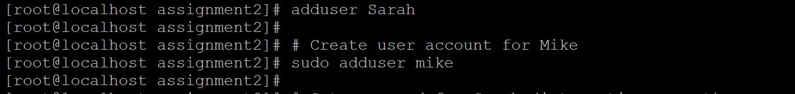
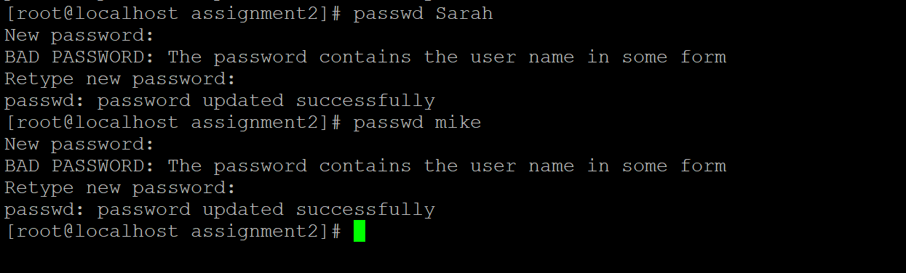
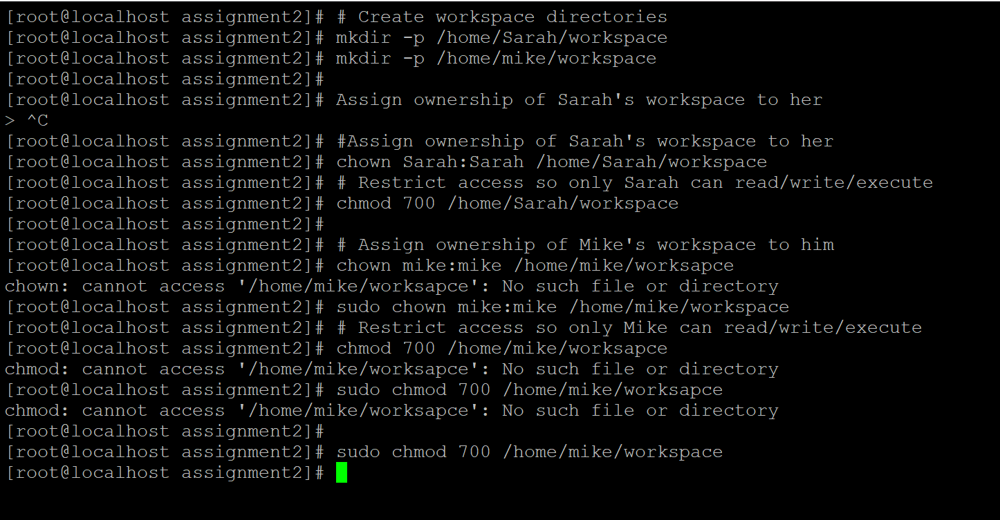
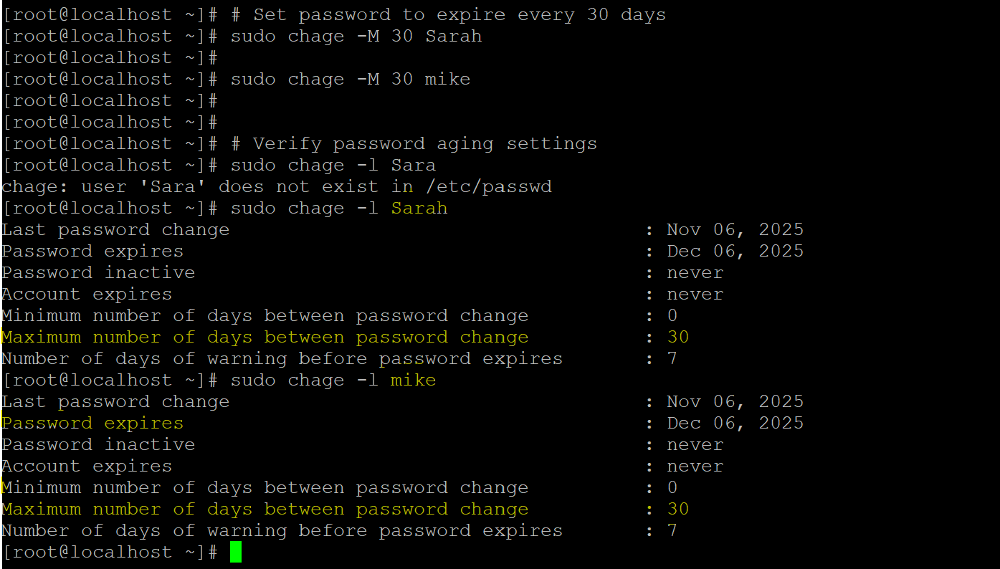
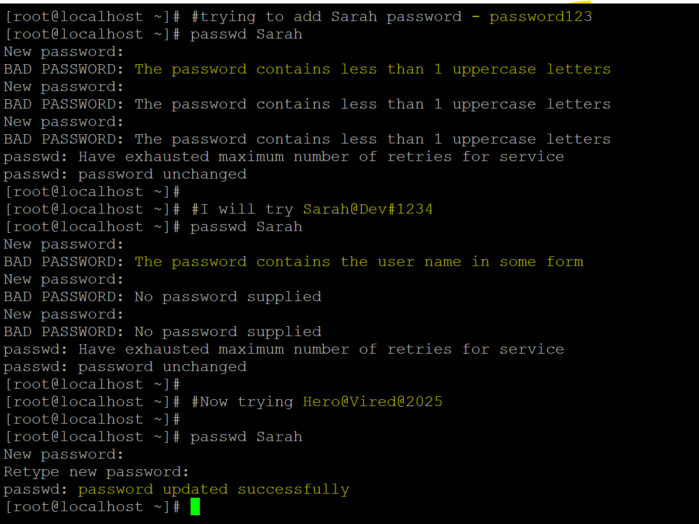

# 🛡️ Task 2: User Management and Access Control

## 📌 Problem Statement (Simplified)

TechCorp has onboarded two new developers, Sarah and Mike. As a DevOps engineer, your job is to:

- Create secure user accounts for them.
- Set up isolated workspaces so they can't access each other's files.
- Enforce a password policy that ensures strong passwords and automatic expiration every 30 days.

This ensures a secure, compliant, and maintainable development environment.

---

## 🧭 Solution Approach

To meet the requirements, we’ll follow these steps:

1. **Create user accounts** with secure passwords.
2. **Set up isolated directories** with proper ownership and permissions.
3. **Enforce password policies** using `chage` and `pam_pwquality`.
4. **Document each step** with terminal outputs and screenshots for auditability.

All commands are designed to be reproducible and compliant with standard Linux environments.

---

## 🛠️ Step-by-Step Implementation

### Step 1: Create User Accounts

```bash
# Create user account for Sarah
sudo adduser Sarah

# Create user account for Mike
sudo adduser mike

# Set password for Sarah (interactive prompt)
sudo passwd Sarah

# Set password for Mike (interactive prompt)
sudo passwd mike
``` 
📝 adduser creates a new user with a home directory and prompts for user details.   
📝 passwd sets or updates the user's password securely.

📸 User creation and password setting



***

### Step 2: Create Isolated Workspace Directories
```
# Create workspace directories
sudo mkdir -p /home/Sarah/workspace
sudo mkdir -p /home/mike/workspace

# Assign ownership of Sarah's workspace to her
sudo chown Sarah:Sarah /home/Sarah/workspace

# Restrict access so only Sarah can read/write/execute
sudo chmod 700 /home/Sarah/workspace

# Assign ownership of Mike's workspace to him
sudo chown mike:mike /home/mike/workspace

# Restrict access so only Mike can read/write/execute
sudo chmod 700 /home/mike/workspace
```
📝 mkdir -p creates the directory and parent folders if needed.  
📝 chown sets ownership to the respective user.   
📝 chmod 700 gives full access to the owner, and denies access to others.

📸 Screenshot Placeholder: 



***

### Step 3: Enforce Password Expiration Policy

- Ensure libpam-pwquality is installed for complexity enforcement:
```
 yum install libpam-pwquality
```

- set password related policies
```
# Set password to expire every 30 days
sudo chage -M 30 Sarah
sudo chage -M 30 mike

# Verify password aging settings
sudo chage -l Sarah
sudo chage -l mike
```

📝 chage -M 30 sets maximum password age to 30 days.  
📝 chage -l lists current password aging settings for the user.      

📸 Password expiration verification


***

### Step 4: Enforce Password Complexity

```
# Install core password quality library
sudo yum install libpwquality
```
📝 libpwquality provides the backend for password strength checking.    
❗ pam_pwquality is not available as a separate package on CentOS Stream 10, but the PAM module is already present. 

```
# Open PAM password stack
sudo nano /etc/pam.d/system-auth

Updated line:
password    requisite    pam_pwquality.so retry=3 enforce_for_root enforce=everyone

---

# Open password quality configuration file
sudo nano /etc/security/pwquality.conf

Configured settings:
minlen = 12        # Minimum password length
dcredit = -1       # Require at least one digit
ucredit = -1       # Require at least one uppercase letter
ocredit = -1       # Require at least one special character
lcredit = -1       # Require at least one lowercase letter

```
📝 This file controls password strength rules via PAM (Pluggable Authentication Modules).  
📝 These rules enforce strong password complexity for all users.   
📝 Negative values mean "must include at least one" of the specified character type.         

📸  Password complexity configuration


---

### 📘 Learnings

This task helped reinforce several foundational DevOps and Linux administration concepts:

### ✅ User Management
- Learned how to use `adduser` and `passwd` to securely create and manage user accounts.
- Understood the importance of using `sudo` for administrative tasks and ensuring reproducibility via CLI commands.

### ✅ Directory Isolation and Permissions
- Practiced using `mkdir`, `chown`, and `chmod` to create secure, user-specific workspaces.
- Understood permission modes like `700` to restrict access to only the directory owner.

### ✅ Password Expiration Policies
- Used `chage` to enforce password aging, ensuring users update credentials regularly.
- Verified expiration settings with `chage -l` for auditability.

### ✅ Password Complexity Enforcement
- Edited `/etc/security/pwquality.conf` to enforce strong password rules using PAM.
- Learned how `minlen`, `dcredit`, `ucredit`, `ocredit`, and `lcredit` settings improve security posture.

### ✅ Audit-Ready Documentation
- Documented each step with clear commands and placeholders for screenshots.
- Ensured all actions are reproducible and compliant with standard Linux environments.

---

> 🧠 This task emphasized the importance of secure defaults, least privilege access, and proactive policy enforcement—core principles in DevOps and system hardening.

