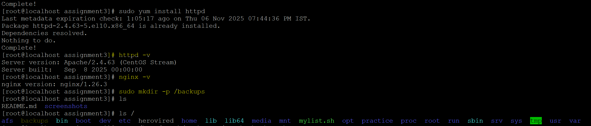
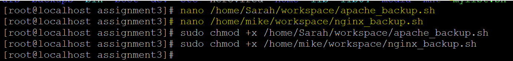
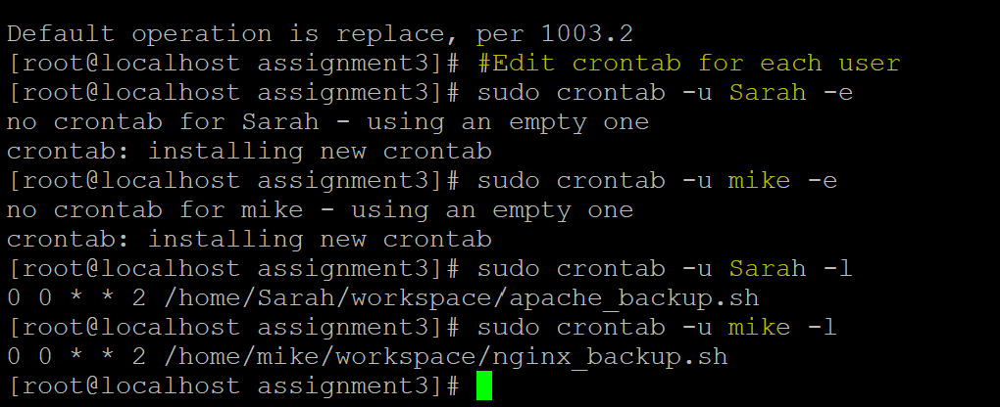
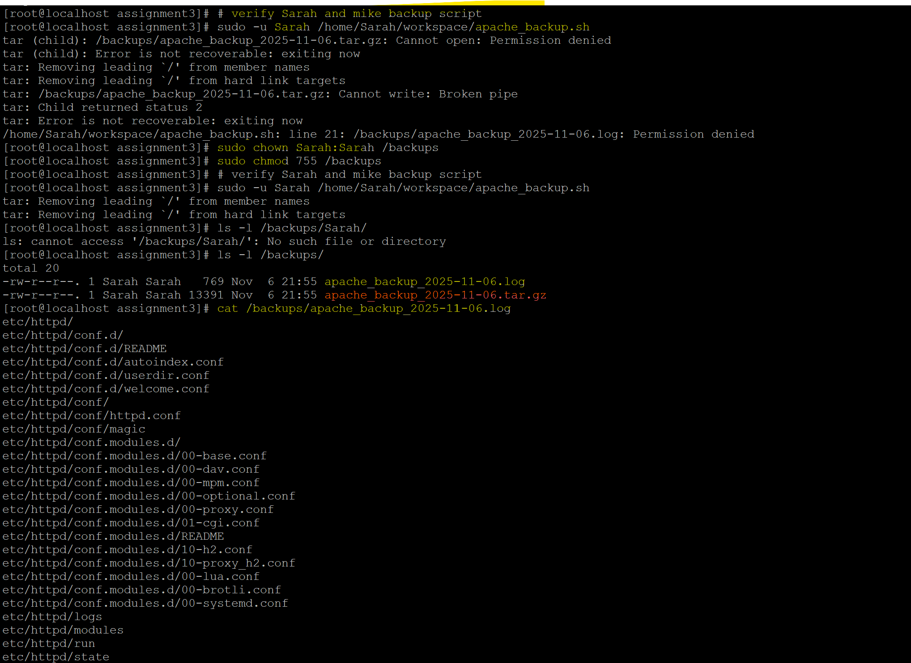

# 🗄️ Task 3: Backup Configuration for Web Servers

## 📌 Problem Statement

Sarah and Mike manage Apache and Nginx web servers respectively. To ensure disaster recovery and data integrity, they need automated weekly backups of their server configurations and document roots.

Sarah: Backup the Apache configuration (/etc/httpd/) and document root (/var/www/html/). 

Mike: Backup the Nginx configuration (/etc/nginx/) and document root (/usr/share/nginx/html/). 

Schedule the backups to run every Tuesday at 12:00 AM using cron jobs. Save the backups as compressed files in /backups/ with filenames including the server name and date (e.g., apache_backup_YYYY-MM-DD.tar.gz). 

Verify the backup integrity after each run by listing the contents of the compressed file. 

Expected Output: Cron job configurations for Sarah and Mike. Backup files are created in the /backups/ directory. A verification log showing the backup integrity.

---

## 🧭 Solution Approach

To meet the requirements, we’ll:

1. Create backup scripts for Apache and Nginx.
2. Schedule cron jobs to run every Tuesday at 12:00 AM.
3. Save compressed backups in `/backups/` with date-based filenames.
4. Verify backup integrity by listing contents after each run.
5. Document all steps with terminal outputs and screenshots.

---

## 🛠️ Step-by-Step Implementation

### Step 1: Create Backup Directory

Create backup directory if it doesn't exist  
```
sudo mkdir -p /backups
```

📸 Backup directory creation



***


### Step 2: Create Backup Script for Sarah (Apache)

Create script /home/Sarah/workspace/apache_backup.sh  
```
#!/bin/bash

DATE=$(date +%F)
BACKUP_FILE="/backups/apache_backup_$DATE.tar.gz"

# Create compressed backup
tar -czf "$BACKUP_FILE" /etc/httpd/ /var/www/html/

# Verify contents
tar -tzf "$BACKUP_FILE" > "/backups/apache_backup_$DATE.log"
```

Make it executable    
```
sudo chmod +x /home/Sarah/apache_backup.sh
```
📸 Apache backup script and log verification


 
***


### Step 3: Create Backup Script for Mike (Nginx)

Create script /home/mike/nginx_backup.sh
```
#!/bin/bash

DATE=$(date +%F)
BACKUP_FILE="/backups/nginx_backup_$DATE.tar.gz"

# Create compressed backup
tar -czf "$BACKUP_FILE" /etc/nginx/ /usr/share/nginx/html/

# Verify contents
tar -tzf "$BACKUP_FILE" > "/backups/nginx_backup_$DATE.log"
```

Make it executable: 
```
sudo chmod +x /home/mike/nginx_backup.sh
```

📸 Nginx backup script and log verification


***

### Step 4: Schedule Cron Jobs

Edit crontab for each user
```
# For Sarah
# This command is used to edit the crontab (cron job list) for the user Sarah, with elevated
# privileges (sudo)
# -u Sarah : Specifies the user whose crontab you want to access.
# -e : Opens the crontab in edit mode using the default text editor (usually nano or vi).
sudo crontab -u Sarah -e

┌───────────── minute (0 - 59)
│ ┌───────────── hour (0 - 23)
│ │ ┌───────────── day of month (1 - 31)
│ │ │ ┌───────────── month (1 - 12)
│ │ │ │ ┌───────────── day of week (0 - 7) (Sunday = 0 or 7)
│ │ │ │ │
│ │ │ │ │
0  0  *  *  2   /home/Sarah/apache_backup.sh

# For Mike
sudo crontab -u mike -e

0 0 * * 2 /home/mike/nginx_backup.sh

# Verify Cron Jobs
sudo crontab -u Sarah -l
sudo crontab -u mike -l

```
📝 0 0 * * 2 means every Tuesday at 12:00 AM.  



***

### 🔍 Step 5: Verify Backup Integrity
After a scheduled run or manual test:
```
# List contents of backup log
cat /backups/apache_backup_YYYY-MM-DD.log
cat /backups/nginx_backup_YYYY-MM-DD.log
```

✅ Confirm that expected files and directories are listed.

📸 Backup verification logs



***

### 🔧 Troubleshooting and Permission Fixes

During manual testing of the backup script, the following errors were encountered:

#### ❌ Error 1: `tar: command not found`

- **Cause:** The `tar` command was not found in Sarah’s environment.
- **Fix:** Verified installation using `which tar`. If missing, installed via:
  ```bash
  sudo yum install tar

#### ❌ Error 2: Permission denied when writing to /backups/
Cause: Sarah’s script failed to write backup and log files to /backups/ due to lack of write permissions. 

Fix: Created a dedicated subdirectory for Sarah:
```
sudo mkdir -p /backups/Sarah
sudo chown Sarah:Sarah /backups/Sarah
```

***


📘 Learnings
- Practiced using tar for multi-directory compression.

- Learned cron syntax for weekly scheduling.

- Used tar -tzf to verify archive contents without extraction.

- Ensured reproducibility and auditability through logs and script documentation.
